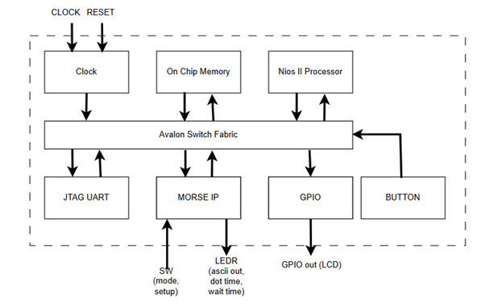
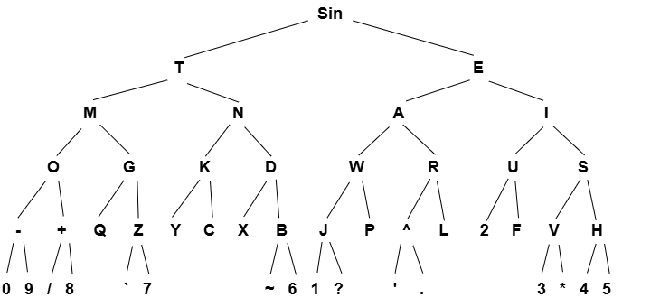
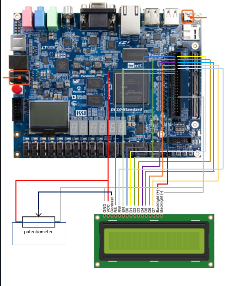

# MORSE IP CORE — Mô tả thiết kế chi tiết
## Hệ thống SoC giải mã Morse và hiển thị LEDR & LCD
 
| | |
|---|---|
| **SVTH** | Trần Hồng Sơn |
| **Môn học** | Thực hành thiết kế SoC|
| **Platform** | Terasic DE10 Standard (Intel Cyclone V) · Quartus Prime |
 
---
 
## Mục lục
 
1. [Giới thiệu](#i-giới-thiệu)
2. [Tổng quan hệ thống](#ii-tổng-quan-hệ-thống)
3. [Mô tả thiết kế IP](#iii-mô-tả-thiết-kế-ip)
4. [Thanh ghi Avalon (Register Map)](#iv-thanh-ghi-avalon-register-map)
5. [Máy trạng thái hữu hạn (FSM)](#v-máy-trạng-thái-hữu-hạn-fsm)
6. [Logic giải mã Morse](#vi-logic-giải-mã-morse)
7. [Mô tả hệ thống SoC](#vii-mô-tả-hệ-thống-soc)
8. [Phần mềm điều khiển (C Code)](#viii-phần-mềm-điều-khiển-c-code)
9. [Kết quả mô phỏng và thực tế](#ix-kết-quả-mô-phỏng-và-thực-tế)
10. [Đánh giá](#x-đánh-giá)
---
 
## I. Giới thiệu
 
Mã Morse là hệ thống mã hóa thông tin văn bản dạng số, chữ cái và ký tự sử dụng các chuỗi tín hiệu có độ dài khác nhau — **dấu chấm (dot/dit)** và **dấu gạch (dash/dah)** — để đại diện cho ký tự trong bảng chữ cái, số và ký tự đặc biệt. Được phát minh vào những năm 1830 bởi **Samuel Morse** và **Alfred Vail**, mã Morse ban đầu dùng để truyền thông qua điện báo.
 
**Ứng dụng nổi bật:**
- Hàng hải và cứu hộ — tín hiệu SOS (`...---...`)
- Dự phòng trong truyền tải khi các phương thức khác gặp sự cố
- Lĩnh vực quân sự — mã hóa liên lạc thư tín
- Đồ án này xây dựng **IP giải mã Morse** trên FPGA (Terasic DE10 Standard), tích hợp vào hệ thống SoC Nios II, với kết quả hiển thị ra **LEDR** và **LCD 16×2**.
 
---
 
## II. Tổng quan hệ thống
 
### 2.1 Sơ đồ khối hệ thống
 


 
### 2.2 Các thành phần chính
 
| Thành phần | Mô tả |
|------------|-------|
| **Nios II Processor** | CPU mềm điều khiển hệ thống qua Avalon |
| **On-Chip Memory** | Bộ nhớ chương trình và dữ liệu |
| **JTAG UART** | Giao tiếp debug và in kết quả (`printf`) |
| **MORSE IP** | IP giải mã Morse (Avalon Slave + Conduit) |
| **GPIO PIO** | Điều khiển LCD 16×2 qua 16 bit GPIO |
| **BUTTON PIO** | Đọc trạng thái KEY[3:1] |
 
### 2.3 Sơ đồ Top-level (`Morse_top.v`)
 
```verilog
module Morse_top (
    input         CLOCK_50,
    input  [9:0]  SW,
    input  [3:0]  KEY,
    output [15:0] GPIO,
    output [9:0]  LEDR
);
    Morse_hw sys (
        .clk_clk                           (CLOCK_50),
        .reset_reset_n                     (KEY[0]),
        .button_external_connection_export (KEY[3:1]),
        .gpio_external_connection_export   (GPIO[15:0]),
        .morse_hw_0_ascii_out_export       (LEDR[7:0]),
        .morse_hw_0_dot_time_export        (LEDR[8]),
        .morse_hw_0_wait_time_export       (LEDR[9]),
        .morse_hw_0_mode_export            (SW[9]),
        .morse_hw_0_setup_export           (SW[7:0])
    );
endmodule
```
 
---
 
## III. Mô tả thiết kế IP
 
### 3.1 Module signature
 
```verilog
module Morse_IP
#(
    parameter DOT_TIME  = 25_000_000,  // 0.5 s tại 50 MHz
    parameter WAIT_TIME = 50_000_000   // 1.0 s tại 50 MHz
) (
    input         clk,
    input         reset_n,
 
    // Avalon-MM Slave
    input         write,
    input         read,
    input  [1:0]  address,
    input  [31:0] writedata,
    output reg [31:0] readdata,
 
    // Conduit
    input  [7:0]  inital,      // SW[7:0]: {length[7:5], morse_code[4:0]}
    input         MODE,         // SW[9]:  0 = setup, 1 = button-press
    output reg [7:0] ascii_out,
    output reg    dot_t,
    output reg    wait_t
);
```
 
### 3.2 Hai chế độ encoder
 
IP hỗ trợ **2 chế độ** điều khiển bởi tín hiệu `MODE` (gắn với `SW[9]`):
 
#### Mode 0 — Setup / Manual Mode (`SW[9] = 0`)
 
- Đọc trực tiếp từ conduit `inital` (8 bit, gắn `SW[7:0]`):
  - **Bits [7:5]**: `length` — số ký hiệu Morse (3 bit, giá trị 1–5)
  - **Bits [4:0]**: `morse_code` — mã Morse đóng gói (LSB = ký hiệu đầu tiên)
- Logic giải mã tổ hợp lập tức cho ra `ascii_out`.
- Không cần FSM. Hữu ích để kiểm tra bảng giải mã qua DIP switch.
#### Mode 1 — Real-time Button-press Mode (`SW[9] = 1`)
 
- Người dùng nhấn `KEY[1]` để nhập ký hiệu Morse theo thời gian thực.
- FSM 3 trạng thái đo thời gian nhấn để phân biệt **dot** và **dash**.
- Sau khi kết thúc (timeout `WAIT_TIME`), `ascii_out` được cập nhật.
- `KEY[3]` kích hoạt ghi `ascii_out` lên LCD từ C code.
- `KEY[2]` reset buffer để nhập ký tự mới.
- `KEY[0]` là `reset_n` toàn cục (active-low).

So sánh Encoder/Decoder theo Mode
 
| Tiêu chí | Mode 0 (Setup) | Mode 1 (Button) |
|----------|:--------------:|:---------------:|
| **Nguồn `morse_code`** | `SW[4:0]` (inital) | FSM shift register |
| **Nguồn `length`** | `SW[7:5]` (inital) | FSM đếm lần nhấn |
| **Encoder có hoạt động?** | ❌ Bỏ qua | ✅ FSM đo thời gian |
| **Decoder có hoạt động?** | ✅ Luôn chạy | ✅ Luôn chạy |
| **Tốc độ cập nhật `ascii_out`** | Tức thì theo SW | Sau mỗi ký hiệu nhấn |
| **Phù hợp cho** | Debug, kiểm tra bảng | Nhập Morse thực tế |
| **`ascii_out` khi length = 0** | `0x5F` (`_`) | `0x5F` (`_`) |
 
---
### 3.3 Tổng quan 
 
Morse IP hoạt động theo **hai bước xử lý nối tiếp nhau**: Encoder (mã hóa tín hiệu vật lý thành chuỗi Morse) và Decoder (giải mã chuỗi Morse thành ASCII). Hai bước này luôn tồn tại đồng thời, nhưng vai trò của Encoder thay đổi tùy theo `MODE`.
 
```
┌──────────────────────────────────────────────────────────────────┐
│                  Morse IP — Luồng xử lý nội bộ                   │
│                                                                  │
│      [ENCODER]                            [DECODER]              │
│      Button/ SW                       {length, morse_code}       │
│         │                                     │                  │
│         ▼                                     ▼                  │
│  Đo thời gian nhấn nút           Tra bảng case-case lồng nhau    │
│  hoặc đọc SW[7:0] trực tiếp      theo length + morse_code        │
│         │                                     │                  │
│         ▼                                     ▼                  │
│  {length[2:0], morse_code[4:0]}        ascii_out[7:0]            │
│  (thanh ghi nội bộ)                    → LEDR + LCD              │
└──────────────────────────────────────────────────────────────────┘
```
 
> **Lưu ý quan trọng:** IP này **luôn là decoder ở đầu ra** — đầu ra cuối cùng luôn là `ascii_out`. Phần Encoder chỉ là bước trung gian tạo ra `{length, morse_code}` từ tín hiệu đầu vào khác nhau tùy mode.
 
---
 
## IV. Thanh ghi Avalon (Register Map)
 
Morse IP có **4 thanh ghi 32-bit** (2-bit address, offset 0–3):
 
| Offset | Tên | Truy cập | Bits | Mô tả |
|--------|-----|----------|------|-------|
| `0` | `signal` | **W** | `[1:0]` | **Ghi:** bit[1] = enable/reset (0 → async reset `morse_code` & `length`); bit[0] = trạng thái KEY[1] live |
| `0` | `MODE` | **R** | `[0]` | **Đọc:** chế độ hoạt động hiện tại (mirror của conduit `MODE`) |
| `1` | `morse_code` | **R** | `[4:0]` | Thanh ghi shift accumulate mã Morse hiện tại (5 bit) |
| `2` | `length` | **R** | `[2:0]` | Số ký hiệu đã nhận (0–5) |
| `3` | `ascii_out` | **R** | `[7:0]` | Ký tự ASCII đã giải mã từ `{length, morse_code}` hiện tại |
 
### Chi tiết logic đọc/ghi
 
```verilog
// READ
case (address)
    2'd0: readdata = {31'b0, MODE};
    2'd1: readdata = {27'b0, morse_code};
    2'd2: readdata = {29'b0, length};
    2'd3: readdata = {24'b0, ascii_out};
endcase
 
// WRITE (chỉ offset 0)
// address 2'd0: signal = writedata[1:0]
// Bit[1] = 0 → async reset toàn bộ FSM (negedge signal[1])
// Bit[0] = KEY[1] live value (từ btn & 0x1)
```
 
**Ví dụ C code ghi:**
```c
IOWR(MORSE_HW_0_BASE, 0, (btn & 0x3));
// btn & 0x1 → KEY[1] state
// btn & 0x2 → enable bit (=1 để giữ trạng thái FSM)
```
 
---
 
## V. Máy trạng thái hữu hạn (FSM)
 
FSM hoạt động khi `MODE = 1`, dùng **3 trạng thái** để đo thời gian nhấn nút.
 
### 5.1 Mã hóa trạng thái
 
| Trạng thái | Mã | Mô tả |
|------------|-----|-------|
| `IDLE` | `2'b00` | Chờ `KEY[1]` được nhấn (`signal[0]` xuống 0) |
| `DETECT` | `2'b01` | `KEY[1]` đang giữ; `timer` đếm thời gian nhấn |
| `RECORD` | `2'b10` | `KEY[1]` đã thả; chờ `WAIT_TIME` cho ký hiệu tiếp theo hoặc kết thúc ký tự |
 
### 5.2 Điều kiện chuyển trạng thái
 
| Từ | Đến | Điều kiện | Hành động |
|----|-----|-----------|-----------|
| — | `IDLE` | `negedge signal[1]` (async reset) | `morse_code=0`, `length=0`, `timer=0` |
| `IDLE` | `IDLE` | `signal[0] = 1` (không nhấn) | `timer = 0` |
| `IDLE` | `DETECT` | `signal[0] = 0` (nhấn nút) | `length = length + 1` |
| `DETECT` | `DETECT` | `signal[0] = 0` (đang giữ) | `timer = timer + 1` |
| `DETECT` | `RECORD` | `signal[0] = 1` (thả nút) | Nếu `timer < DOT_TIME`: append `0` (dot); ngược lại append `1` (dash) |
| `RECORD` | `RECORD` | `timer ≤ WAIT_TIME` | `timer = timer + 1` |
| `RECORD` | `IDLE` | `timer > WAIT_TIME` | `timer = 0` (bắt đầu ký tự mới) |
 
### 5.3 Sơ đồ trạng thái
 
```
   negedge signal[1]  ←──────────────────────────────────────────
   (async reset)                                  (timeout done)  |
        ↓                                                         |
   ┌─────────┐   signal[0]=0    ┌──────────┐                     |
   │  IDLE   │─────────────────→│  DETECT  │←────────────────    |
   │ length++│  (btn pressed)   │ timer++  │    (not timeout)    |
   └─────────┘                  └──────────┘                     |
        ↑                            │  signal[0]=1              |
        │                            │  (btn released)           |
        │                            ↓                           |
        │                       ┌──────────┐                     |
        │   timer > WAIT_TIME   │  RECORD  │─────────────────────┘
        └───────────────────────│  timer++ │
                                └──────────┘
```
 
### 5.4 Cơ chế Shift Register mã Morse
 
Mỗi ký hiệu mới được nối vào `morse_code` theo hướng LSB:
 
```verilog
// Dot (nhấn ngắn < DOT_TIME)
morse_code = {morse_code[3:0], 1'b0};
 
// Dash (nhấn dài ≥ DOT_TIME)
morse_code = {morse_code[3:0], 1'b1};
```
 
`length` theo dõi số ký hiệu đã dịch. Logic giải mã dùng `length` để chọn đúng số bit cần đọc từ `morse_code`.
 
---
 
## VI. Logic giải mã Morse
 
Logic tổ hợp `always @(*)` chuyển đổi `{length, morse_code}` → ASCII byte.
 
### 6.1 Sơ đồ cây Morse (custom)
 

 
> **Quy ước:** Trái = dot (0), Phải = dash (1). `length` = độ sâu trong cây.
> Mọi giá trị không hợp lệ hoặc `length = 0` → xuất `0x5F` (`_`).
 
### 6.2 Bảng giải mã đầy đủ
 
#### Length = 1
 
| `morse_code[0]` | Morse | ASCII | Ký tự |
|:---:|:---:|:---:|:---:|
| `0` | `.` | `0x45` | **E** |
| `1` | `-` | `0x54` | **T** |
 
#### Length = 2
 
| `morse_code[1:0]` | Morse | ASCII | Ký tự |
|:---:|:---:|:---:|:---:|
| `00` | `..` | `0x49` | **I** |
| `01` | `.-` | `0x41` | **A** |
| `10` | `-.` | `0x4E` | **N** |
| `11` | `--` | `0x4D` | **M** |
 
#### Length = 3
 
| `morse_code[2:0]` | Morse | ASCII | Ký tự |
|:---:|:---:|:---:|:---:|
| `000` | `...` | `0x53` | **S** |
| `001` | `..-` | `0x55` | **U** |
| `010` | `.-.` | `0x52` | **R** |
| `011` | `.--` | `0x57` | **W** |
| `100` | `-..` | `0x44` | **D** |
| `101` | `-.-` | `0x4B` | **K** |
| `110` | `--.` | `0x47` | **G** |
| `111` | `---` | `0x4F` | **O** |
 
#### Length = 4
 
| `morse_code[3:0]` | Morse | ASCII | Ký tự |
|:---:|:---:|:---:|:---:|
| `0000` | `....` | `0x48` | **H** |
| `0001` | `...-` | `0x56` | **V** |
| `0010` | `..-. ` | `0x46` | **F** |
| `0011` | `..--` | `0x32` | **2** |
| `0100` | `.-..` | `0x4C` | **L** |
| `0101` | `.-.-` | `0x5E` | **^** |
| `0110` | `.--. ` | `0x50` | **P** |
| `0111` | `.---` | `0x4A` | **J** |
| `1000` | `-...` | `0x42` | **B** |
| `1001` | `-..-` | `0x58` | **X** |
| `1010` | `-.-.` | `0x43` | **C** |
| `1011` | `-.--` | `0x59` | **Y** |
| `1100` | `--..` | `0x5A` | **Z** |
| `1101` | `--.-` | `0x51` | **Q** |
| `1110` | `---.` | `0x2B` | **+** |
| `1111` | `----` | `0x2D` | **-** |
 
#### Length = 5
 
| `morse_code[4:0]` | Morse | ASCII | Ký tự |
|:---:|:---:|:---:|:---:|
| `00000` | `.....` | `0x35` | **5** |
| `00001` | `....-` | `0x34` | **4** |
| `00010` | `...-. ` | `0x2A` | **\*** |
| `00011` | `...--` | `0x33` | **3** |
| `01010` | `.-.-. ` | `0x2E` | **.** |
| `01011` | `.-.--` | `0x22` | **'** |
| `01110` | `.---.` | `0x3F` | **?** |
| `01111` | `.----` | `0x31` | **1** |
| `10000` | `-....` | `0x36` | **6** |
| `10001` | `-...-` | `0x7E` | **~** |
| `11000` | `--...` | `0x37` | **7** |
| `11001` | `--..-` | `0x27` | **\`** |
| `11100` | `---..` | `0x38` | **8** |
| `11101` | `---.-` | `0x2F` | **/** |
| `11110` | `----.` | `0x39` | **9** |
| `11111` | `-----` | `0x3A` | **0** |
| default | — | `0x5F` | **\_** (không hợp lệ) |
 
---
 
## VII. Mô tả hệ thống SoC
 
### 7.1 Địa chỉ Platform Designer
 
| Thành phần | Địa chỉ cơ sở | Địa chỉ cuối | Ghi chú |
|------------|---------------|--------------|---------|
| `nios2_gen2_0` | — | — | Nios II/e Processor |
| `onchip_memory2_0` | `0x0000_0000` | `0x0000_FFFF` | On-Chip RAM/ROM (64 KB) |
| `jtag_uart_0` | `0x0001_1030` | `0x0001_1037` | JTAG UART |
| `button` | `0x0001_1020` | `0x0001_102F` | PIO — KEY[3:1] input |
| `gpio` | `0x0001_1010` | `0x0001_101F` | PIO — GPIO[15:0] output → LCD |
| `morse_hw_0` | `0x0001_1000` | `0x0001_100F` | Morse IP Slave (4 × 32-bit) |
 
### 7.2 Kết nối chân LCD 16×2 với GPIO
 
LCD 16×2 được điều khiển qua `GPIO[15:0]` với cấu trúc:
 
| GPIO bits | Chức năng | Mô tả |
|-----------|-----------|-------|
| `[7:0]` | D7–D0 data bus | Dữ liệu lệnh hoặc ký tự |
| `[8]` | EN (Enable strobe) | Xung kích hoạt LCD |
| `[10]` | RS (Register Select) | `0` = lệnh, `1` = dữ liệu |

 Sơ đồ kết nối chân 
---
 

 ---
**Giá trị ghi để điều khiển:**
 
```c
// Ghi lệnh: RS=0, EN pulse
IOWR_ALTERA_AVALON_PIO_DATA(GPIO_BASE, 0x0100 | cmd); // EN=1
delay_ms(40);
IOWR_ALTERA_AVALON_PIO_DATA(GPIO_BASE, 0x0000 | cmd); // EN=0
delay_ms(40);
 
// Ghi dữ liệu: RS=1 (bit 10), EN pulse
IOWR_ALTERA_AVALON_PIO_DATA(GPIO_BASE, 0x0500 | data); // RS=1, EN=1
delay_ms(40);
IOWR_ALTERA_AVALON_PIO_DATA(GPIO_BASE, 0x0400 | data); // RS=1, EN=0
delay_ms(40);
```
 
---
 
## VIII. Phần mềm điều khiển (C Code)
 
### 8.1 Khởi tạo LCD
 
```c
void SendCommand(alt_u8 cmd) {
    IOWR_ALTERA_AVALON_PIO_DATA(GPIO_BASE, 0x0100 | cmd);
    delay_ms(40);
    IOWR_ALTERA_AVALON_PIO_DATA(GPIO_BASE, 0x0000 | cmd);
    delay_ms(40);
}
 
void SendData(alt_u8 data) {
    IOWR_ALTERA_AVALON_PIO_DATA(GPIO_BASE, 0x0500 | data);
    delay_ms(40);
    IOWR_ALTERA_AVALON_PIO_DATA(GPIO_BASE, 0x0400 | data);
    delay_ms(40);
}
```
 
### 8.2 Trình tự khởi động LCD
 
| Bước | Lệnh | Mô tả |
|------|------|-------|
| 1 | `SendCommand(0x01)` | Xóa màn hình |
| 2 | `SendCommand(0x38)` | 8-bit, 2 dòng, font 5×8 |
| 3 | `SendCommand(0x0F)` | Bật màn hình, con trỏ nhấp nháy |
| 4 | `SendCommand(0x06)` | Entry mode: tự tăng, không shift |
| 5 | `SendCommand(0x80)` | Đặt DDRAM → dòng 1, cột 0 |
| 6 | Ghi chuỗi `"20200331 sOC"` | In header 12 ký tự |
| 7 | `SendCommand(0xC0)` | Di chuyển con trỏ → dòng 2 |
 
---
 
### 8.3 Tóm tắt vai trò các KEY
 
| KEY | Chức năng |
|-----|-----------|
| `KEY[0]` | `reset_n` — reset toàn hệ thống (active-low) |
| `KEY[1]` | Tín hiệu nhập Morse — nhấn ngắn = dot, nhấn dài = dash |
| `KEY[2]` | Trigger ghi ký tự lên LCD (active-low) |
| `KEY[3]` | (dự phòng — nối vào button PIO) |
 
---
 
## IX. Kết quả mô phỏng và thực tế
 
### 9.1 Kết quả mô phỏng IP
 
#### Trường hợp Mode 0 (setup từ SW)
 
| `inital` (binary) | `length` (bits[7:5]) | `morse_code` (bits[4:0]) | `ascii_out` | Ký tự |
|:-----------------:|:-------------------:|:------------------------:|:-----------:|:-----:|
| `0b00000000` | `0` | `00000` | `0x5F` | `_` (Sin — không hợp lệ) |
| `0b00100000` | `1` | `00000` | `0x45` | **E** |
| `0b01100011` | `3` | `00011` | `0x57` | **W** |
| `0b01100101` | `3` | `00101` | `0x48` | **H** |
 
#### Trường hợp Mode 1 (nhấn nút thực tế)
 
| `signal` ghi vào | Sự kiện | `length` | `morse_code` | `ascii_out` |
|:----------------:|---------|:--------:|:------------:|:-----------:|
| `0x0` | Reset (`signal[1]=0`) | 0 | `00000` | `0x5F` (`_`) |
| `0x2` | Enable FSM (`signal[1]=1`) | 0 | `00000` | `0x5F` |
| `0x2→0x0→0x2` | Nhấn và thả ngắn (dot) | 1 | `00000` | `0x45` (**E**) |
| Nhấn thả dài (dash) sau dot | 2 dashes | 2 | `00011` | — |
 
### 9.2 Kết quả chạy thực tế trên DE10 Standard
 
#### Mode 0 — Kiểm tra giải mã bằng DIP switch
 
**Ví dụ 1: G**
```
Length = 0b11 (3), morse_code = 0b00110
→ ascii_out = 0x47 (G)
→ LCD dòng 2 hiển thị: GG
→ LEDR[7:0] = 01000111b
```
 
**Ví dụ 2: O**
```
Length = 0b011 (3), morse_code = 0b01111
→ ascii_out = 0x4F (O)
→ LEDR hiển thị pattern tương ứng
```
 
#### Mode 1 — Nhập Morse bằng KEY[1]
 
**Ví dụ 1:** Length=5, morse_code=`0b00011` → `0x33` (**số 3**)
```
Console output:
Hold mode work: 1
Hold reg: 0x1
Hold bit: 0x4
Hold ASCII code: 0x33
LCD dòng 2: SUUU3
```
 
**Ví dụ 2:** Nhập liên tiếp nhiều ký tự
```
LCD dòng 2: ZUUU33_ (hiển thị tuần tự các ký tự)
```
 
### 9.3 Bảng tín hiệu theo chế độ
 
| Tín hiệu | Mode 0 (SW) | Mode 1 — IDLE | Mode 1 — DETECT | Mode 1 — RECORD |
|----------|:-----------:|:-------------:|:---------------:|:---------------:|
| `MODE` | `0` | `1` | `1` | `1` |
| `state` | — | `2'b00` | `2'b01` | `2'b10` |
| `signal[0]` (KEY[1]) | — | `1` | `0` (held) | `1` (released) |
| `timer` | — | `0` | đếm tăng | đếm tăng |
| `morse_code` | từ `inital[4:0]` | không đổi | không đổi | dịch trái + bit mới |
| `length` | từ `inital[7:5]` | không đổi | `+1` | không đổi |
| `ascii_out` | tức thì | `0x5F` | cập nhật tổ hợp | cập nhật tổ hợp |
| `dot_t` | toggle/`DOT_TIME` | toggle/`DOT_TIME` | toggle/`DOT_TIME` | toggle/`DOT_TIME` |
| `wait_t` | toggle/`WAIT_TIME` | toggle/`WAIT_TIME` | toggle/`WAIT_TIME` | toggle/`WAIT_TIME` |
 
---
 
## X. Đánh giá
 
### 10.1 Kết quả đạt được
 
- ✅ Thiết kế hoạt động đúng ở cả **2 chế độ** (Mode 0 và Mode 1).
- ✅ FSM phân biệt chính xác dot/dash với ngưỡng 0.5 s, timeout 1 s.
- ✅ Bảng giải mã Morse đầy đủ cho chữ cái A–Z, số 0–9 và một số ký tự đặc biệt.
- ✅ Kết quả hiển thị đúng và rõ ràng trên **LCD 16×2** qua điều khiển GPIO.
- ✅ `LEDR[7:0]` hiển thị ASCII nhị phân; `LEDR[8–9]` là chỉ báo clock dot/wait.
- ✅ Mô phỏng xác nhận đúng hành vi cho nhiều trường hợp kiểm thử.
### 10.2 Hạn chế
 
- ⚠️ Chưa mô phỏng đầy đủ bằng ModelSim do hệ thống dùng nhiều tín hiệu thực tế (button timing, LCD strobe).
- ⚠️ Số ký tự hỗ trợ còn hạn chế, **chưa hỗ trợ chữ tiếng Việt** có dấu.
- ⚠️ `DOT_TIME` và `WAIT_TIME` là compile-time parameter, chưa thể điều chỉnh runtime.
- ⚠️ LCD không có cơ chế auto-wrap hay scroll khi đầy 16 ký tự dòng 2.
- ### 10.3 Hướng cải thiện
 
- 🔧 Thêm **hardware timer IP** cho timing chính xác hơn thay vì CPU polling.
- 🔧 Triển khai **LCD auto-scroll** và wrap 2 dòng trong C driver.
- 🔧 Mở rộng bảng Morse để hỗ trợ đầy đủ **ITU-R M.1677-1** (tất cả dấu câu).
- 🔧 Thêm **Avalon Interrupt Sender** để CPU nhận ngắt khi ký tự hoàn chỉnh.
---
## Phụ lục — Giao tiếp giữa LCD 16×2 và Board DE10 Standard
 
### A.1 Tổng quan LCD 16×2 (HD44780)
 
LCD 16×2 sử dụng controller **HD44780** (hoặc tương thích). LCD có 2 dòng, mỗi dòng 16 ký tự. Giao tiếp theo chuẩn **parallel 8-bit**, bao gồm các chân điều khiển và dữ liệu.
 
**Các chân vật lý của LCD:**
 
| Chân LCD | Tên | Mô tả |
|:--------:|-----|-------|
| 1 | VSS | GND |
| 2 | VDD | +5V nguồn |
| 3 | VO (V0) | Điều chỉnh độ tương phản (nối qua biến trở) |
| 4 | **RS** | Register Select: `0` = ghi lệnh, `1` = ghi dữ liệu |
| 5 | **RW** | Read/Write: `0` = ghi, `1` = đọc (nối GND = luôn ghi) |
| 6 | **EN** | Enable — xung cạnh xuống kích hoạt LCD đọc dữ liệu |
| 7–14 | **D0–D7** | Bus dữ liệu 8 bit |
| 15 | A (LED+) | Backlight anode (+5V) |
| 16 | K (LED−) | Backlight cathode (GND) |
 
### A.2 Sơ đồ nối dây LCD với GPIO Board DE10
 
LCD được kết nối với **GPIO[15:0]** của board DE10 Standard. `RW` được nối cố định xuống **GND** (chỉ ghi, không đọc):
 
```
DE10 Standard GPIO Header          LCD 16x2 (HD44780)
─────────────────────────          ──────────────────
GPIO[0]  ──────────────────────→  D0  (chân 7)
GPIO[1]  ──────────────────────→  D1  (chân 8)
GPIO[2]  ──────────────────────→  D2  (chân 9)
GPIO[3]  ──────────────────────→  D3  (chân 10)
GPIO[4]  ──────────────────────→  D4  (chân 11)
GPIO[5]  ──────────────────────→  D5  (chân 12)
GPIO[6]  ──────────────────────→  D6  (chân 13)
GPIO[7]  ──────────────────────→  D7  (chân 14)
GPIO[8]  ──────────────────────→  EN  (chân 6)   ← Enable
GPIO[10] ──────────────────────→  RS  (chân 4)   ← Register Select
GND      ──────────────────────→  RW  (chân 5)   ← cố định GND
GND      ──────────────────────→  VSS (chân 1)
+5V      ──────────────────────→  VDD (chân 2)
Biến trở ──────────────────────→  VO  (chân 3)   ← chỉnh contrast
+5V      ──────────────────────→  A   (chân 15)  ← backlight
GND      ──────────────────────→  K   (chân 16)  ← backlight
```
 
> **Lưu ý:** GPIO[9] không dùng. RS dùng bit 10 (`GPIO[10]`) thay vì bit 9 để tránh xung đột với EN (bit 8).
 
### A.3 Ánh xạ bit GPIO → tín hiệu LCD
 
Toàn bộ GPIO[15:0] được ghi bằng **một lệnh duy nhất** `IOWR_ALTERA_AVALON_PIO_DATA`. Các bit có vai trò:
 
| Bit GPIO | Tín hiệu LCD | Ý nghĩa |
|:--------:|:------------:|---------|
| `[7:0]` | D7–D0 | 8-bit dữ liệu lệnh hoặc ký tự ASCII |
| `[8]` | EN | Enable — tạo xung để LCD chốt dữ liệu |
| `[9]` | *(không dùng)* | Luôn = 0 |
| `[10]` | RS | `0` = chế độ lệnh; `1` = chế độ dữ liệu ký tự |
| `[15:11]` | *(không dùng)* | Luôn = 0 |
 
**Bảng giá trị GPIO theo từng thao tác:**
 
| Thao tác | RS | EN | Giá trị GPIO (hex) | Mô tả |
|----------|:--:|:--:|:------------------:|-------|
| Ghi lệnh, EN=1 | 0 | 1 | `0x0100 \| cmd` | Bit 8 lên 1, bit 10 = 0 |
| Ghi lệnh, EN=0 | 0 | 0 | `0x0000 \| cmd` | Bit 8 xuống 0, LCD chốt lệnh |
| Ghi dữ liệu, EN=1 | 1 | 1 | `0x0500 \| data` | Bit 10=1, bit 8=1 |
| Ghi dữ liệu, EN=0 | 1 | 0 | `0x0400 \| data` | Bit 10=1, bit 8=0, LCD chốt data |
 
> **Giải thích `0x0500`:** `0x0500 = 0b0000_0101_0000_0000` → bit 10 (RS=1) và bit 8 (EN=1) đều lên 1.
 
### A.4 Giản đồ thời gian (Timing Diagram)
 
#### Ghi lệnh (`SendCommand`)
 
```
RS  ────────────────────────────────── (giữ = 0)
 
EN  ────┐           ┌──────────────
        │  40 ms    │  40 ms
        └───────────┘
        ↑           ↑
      EN=1         EN=0
     (lệnh         (LCD chốt
      xuất hiện)    và xử lý)
 
D[7:0] ══════════════════════════════ (cmd byte, ổn định suốt)
         |←── setup ──→|←── hold ──→|
```
 
#### Ghi dữ liệu (`SendData`)
 
```
RS  ══════════════════════════════════ (giữ = 1)
 
EN  ────┐           ┌──────────────
        │  40 ms    │  40 ms
        └───────────┘
 
D[7:0] ══════════════════════════════ (ASCII byte, ổn định suốt)
```
 
> **40 ms delay** mỗi nửa xung EN đảm bảo LCD có đủ thời gian xử lý (LCD HD44780 yêu cầu tối thiểu ~37 µs, nhưng dùng 40 ms để an toàn với soft-delay trên Nios II).
 
### A.5 Hàm điều khiển LCD trong C
 
#### `delay_ms()` — Tạo delay mềm
 
```c
void delay_ms(uint32_t ms) {
    volatile uint32_t count;
    while (ms--) {
        for (count = 0; count < 1000; count++) {
            // vòng lặp trống — tạo trễ ~1 ms tại tần số Nios II
        }
    }
}
```
 
> Đây là **soft delay** phụ thuộc vào tần số clock Nios II. Không chính xác tuyệt đối nhưng đủ dùng cho LCD HD44780.
 
#### `SendCommand()` — Ghi lệnh điều khiển
 
```c
void SendCommand(alt_u8 cmd) {
    // Pha 1: RS=0, EN=1, data=cmd  → LCD nhận lệnh
    IOWR_ALTERA_AVALON_PIO_DATA(GPIO_BASE, 0x0100 | cmd);
    delay_ms(40);
 
    // Pha 2: RS=0, EN=0, data=cmd  → LCD chốt và thực thi lệnh
    IOWR_ALTERA_AVALON_PIO_DATA(GPIO_BASE, 0x0000 | cmd);
    delay_ms(40);
}
```
 
**Ví dụ tính toán bit:**
```
cmd = 0x38 (0b00111000)
Pha 1: 0x0100 | 0x38 = 0x0138 = 0b0000_0001_0011_1000
        → GPIO[8]=1 (EN), GPIO[7:0]=0x38 (D7-D0), GPIO[10]=0 (RS=cmd)
Pha 2: 0x0000 | 0x38 = 0x0038 = 0b0000_0000_0011_1000
        → GPIO[8]=0 (EN xuống → LCD chốt), data vẫn = 0x38
```
 
#### `SendData()` — Ghi ký tự ASCII
 
```c
void SendData(alt_u8 data) {
    // Pha 1: RS=1 (bit10), EN=1 (bit8), data  → LCD nhận ký tự
    IOWR_ALTERA_AVALON_PIO_DATA(GPIO_BASE, 0x0500 | data);
    delay_ms(40);
 
    // Pha 2: RS=1 (bit10), EN=0, data          → LCD chốt và hiển thị
    IOWR_ALTERA_AVALON_PIO_DATA(GPIO_BASE, 0x0400 | data);
    delay_ms(40);
}
```
 
**Ví dụ tính toán bit:**
```
data = 0x47 ('G' = 0b01000111)
Pha 1: 0x0500 | 0x47 = 0x0547 = 0b0000_0101_0100_0111
        → GPIO[10]=1 (RS=data), GPIO[8]=1 (EN), GPIO[7:0]=0x47
Pha 2: 0x0400 | 0x47 = 0x0447 = 0b0000_0100_0100_0111
        → GPIO[10]=1 (RS=data), GPIO[8]=0 (EN xuống → chốt 'G')
```
 
### A.6 Trình tự khởi động LCD đầy đủ
 
Theo datasheet HD44780, LCD cần được khởi động theo thứ tự cố định sau khi cấp nguồn:
 
```c
// Bước 1: Xóa toàn bộ màn hình, đặt cursor về (0,0)
SendCommand(0x01);   // Clear Display
 
// Bước 2: Cấu hình giao tiếp 8-bit, 2 dòng, font 5×8 dot
SendCommand(0x38);   // Function Set: DL=1(8bit), N=1(2line), F=0(5x8)
 
// Bước 3: Bật màn hình, bật cursor, bật nhấp nháy cursor
SendCommand(0x0F);   // Display ON/OFF: D=1, C=1, B=1
 
// Bước 4: Chế độ nhập — cursor tự tăng sang phải, không shift màn hình
SendCommand(0x06);   // Entry Mode Set: I/D=1(increment), S=0(no shift)
 
// Bước 5: Đặt con trỏ DDRAM về dòng 1, cột 0
SendCommand(0x80);   // Set DDRAM Address = 0x00 (dòng 1 đầu)
 
// Bước 6: Ghi chuỗi tiêu đề "20200331 sOC" (12 ký tự)
const int table[12] = {
    0x32, 0x30, 0x32, 0x30,  // "2020"
    0x30, 0x33, 0x33, 0x31,  // "0331"
    0x20,                     // " " (space)
    0x73, 0x4F, 0x43          // "sOC"
};
for (int i = 0; i < 12; i++)
    SendData(table[i]);
 
// Bước 7: Di chuyển cursor sang dòng 2, cột 0
SendCommand(0xC0);   // Set DDRAM Address = 0x40 (dòng 2 đầu)
```
 
**Giải thích địa chỉ DDRAM:**
 
| Dòng | Cột 0–15 | Địa chỉ DDRAM | Lệnh Set Address |
|:----:|:--------:|:-------------:|:----------------:|
| Dòng 1 | 0 → 15 | `0x00` → `0x0F` | `0x80` (= `0x80 | 0x00`) |
| Dòng 2 | 0 → 15 | `0x40` → `0x4F` | `0xC0` (= `0x80 | 0x40`) |
 
### A.7 Bảng lệnh HD44780 được sử dụng
 
| Lệnh (hex) | Tên | DL | N | F | Mô tả |
|:----------:|-----|----|---|---|-------|
| `0x01` | Clear Display | — | — | — | Xóa toàn bộ, cursor về (0,0), DDRAM = 0x20 (space) |
| `0x38` | Function Set | 1 | 1 | 0 | 8-bit, 2 dòng, font 5×8 |
| `0x0F` | Display Control | — | — | — | D=1 (on), C=1 (cursor on), B=1 (blink on) |
| `0x06` | Entry Mode | — | — | — | I/D=1 (increment), S=0 (no shift) |
| `0x80` | Set DDRAM Addr | — | — | — | Đặt cursor về dòng 1, cột 0 (addr=0x00) |
| `0xC0` | Set DDRAM Addr | — | — | — | Đặt cursor về dòng 2, cột 0 (addr=0x40) |
 
### A.8 Luồng hoạt động tổng thể LCD trong hệ thống
 
```
Nios II CPU
    │
    │  IOWR_ALTERA_AVALON_PIO_DATA(GPIO_BASE, value)
    │         (Avalon Write → GPIO PIO Slave)
    ↓
GPIO PIO (16-bit output register)
    │
    │  GPIO[15:0]  (vật lý qua GPIO header)
    ↓
    ├── GPIO[7:0]  ──→  D7–D0  (LCD data bus)
    ├── GPIO[8]    ──→  EN     (Enable)
    └── GPIO[10]   ──→  RS     (Register Select)
                              ↓
                        LCD HD44780
                    (HD44780 controller)
                              │
                    Hiển thị ký tự ra màn hình
                    hoặc thực thi lệnh điều khiển
```
 
### A.9 Ví dụ thực tế: Hiển thị ký tự 'G' (0x47) lên dòng 2
 
```c
// Giả sử cursor đang ở dòng 2 (sau SendCommand(0xC0))
// Morse decode: length=3, morse_code=0b110 → G → ascii_code = 0x47
 
SendData(0x47);  // Ghi 'G'
// Pha 1: GPIO = 0x0500 | 0x47 = 0x0547
//   → RS=1, EN=1, D[7:0]=0x47  (LCD nhận 'G')
//   delay_ms(40)
// Pha 2: GPIO = 0x0400 | 0x47 = 0x0447
//   → RS=1, EN=0, D[7:0]=0x47  (LCD chốt và hiển thị 'G')
//   delay_ms(40)
```
 
Kết quả trên LCD:
```
┌────────────────┐
│ 20200331 sOC   │  ← dòng 1 (cố định từ init)
│ G              │  ← dòng 2 (ký tự được giải mã từ Morse)
└────────────────┘
```
 

 
---
 
*— HẾT —*
